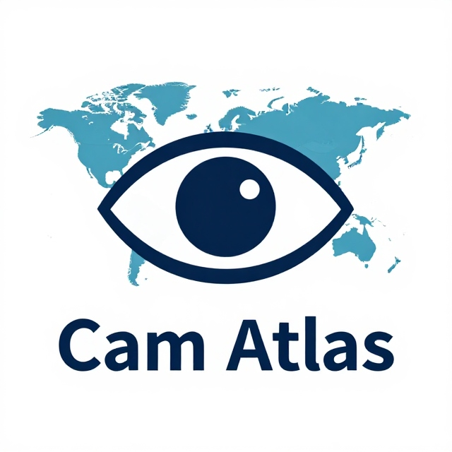

🌍 Cam Atlas – Mapping Public Cameras Worldwide
                                                                                                                                        
CamAtlas is an open-source project that indexes and organizes publicly published webcam feeds such as traffic cameras, weather cameras, tourism webcams, wildlife streams and more.
IT IS CURRENTLY UNFINISHED

Disclaimer: CamAtlas only indexes webcam feeds that are explicitly made public by their owners.
